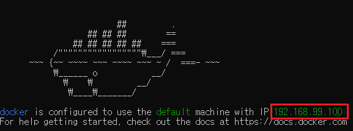
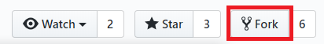
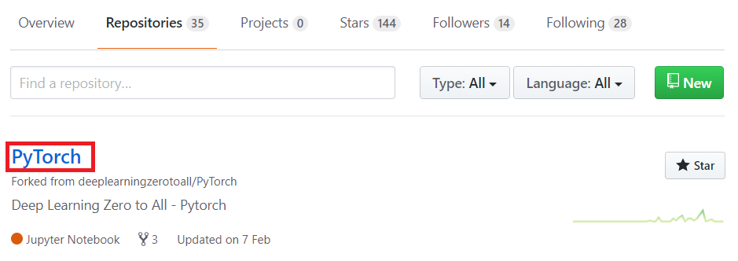
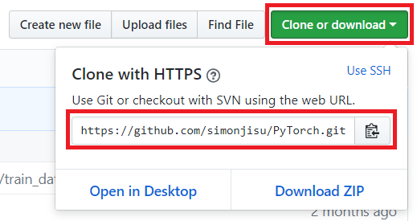
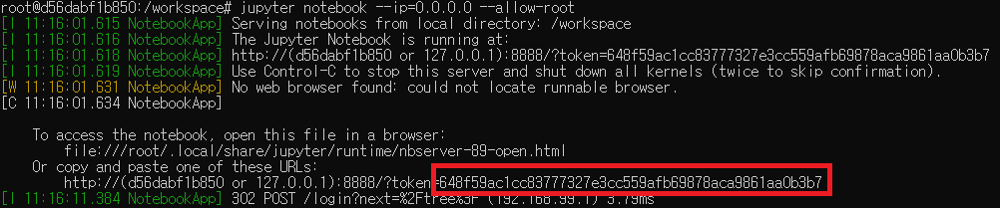
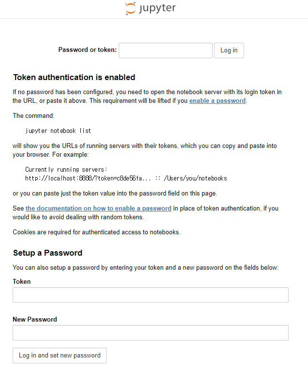

# Docker User Guide

도커를 사용하시는 분들을 위해 작성하는 도커 사용법입니다.

## Docker 설치 안내

[Docker 소개 및 안내](https://youtu.be/7eldOrjQVi0) - 오상준

## Docker 설치후 안내

### Docker 처음 실행

도커 터미널 실행후 아래 그림에 있는 IP 를 잘 기억해두세요! 

앞으로 이 IP 를 사용하여 도커 컨테이너와 소통을 하게 됩니다.



### 도커 이미지 다운로드 받기

hub.docker 에서 도커 이미지를 받아서 컨테이너를 사용할 준비를 합니다. (로그인이 필요 할 수도 있습니다. https://hub.docker.com 에서 가입하세요!)

```
$ docker pull deeplearningzerotoall/pytorch
```

만약에 특별히 다른 버전을 지정하고 싶으면 저희 [docker hub](https://hub.docker.com/r/deeplearningzerotoall/pytorch) 에 접속하셔서 원하시는 버전을 확인합니다. 

이미지를 받으셨으면 `docker images` 명령어를 쳐서 도커 이미지의 존재를 확인해봅니다.

```
$ docker images
REPOSITORY				TAG	...
hello-world				latest	... 
deeplearningzerotoall/pytorch		latest	...
```

### 도커 이미지로부터 컨테이너 실행하고 끄기

도커 이미지로부터 컨테이너를 생성하고 실행합니다. 이때 `--name` 뒤에 원하는 이름을 설정할 수 있습니다. 이번 가이드에서는 `pt` 로 하겠습니다.

```
$ docker run -i -t --name pt -p 8888:8888 -p 8097:8097 deeplearningzerotoall/pytorch /bin/bash
```

이제 거의 다 왔습니다. 도커 컨테이너를 만들었고 root 계정으로 컨테이너 내부 쉘에 접속한 상태입니다.

```
root@[고유번호]:~#
```

만약에 완전히 컨테이너를 끄고 싶다면 `exit` 명령어를 입력하세요!

```
root@[고유번호]:~# exit
```

`docker ps -a` 명령어를 사용해 현재 도커 컨테이너가 켜져있는 여부를 확인 할 수 있습니다. **STATUS** 를 확인하세요

```
$ docker ps -a
```

### 도커 컨테이너 자유롭게 드나들기

**주의**: `docker run` 명령어는 한번 만 실행하시면 됩니다. 종료된 컨테이너를 다시 실행하려면 아래와 같이 실행합니다.

```
$ docker start pt
```

이 단계는 컨테이너를 키기만 했을 뿐입니다. 컨테이너 터미널에 접속하려면 아래와 같이 실행합니다. 그러면 컨테이너 내부 터미널로 이동하게 됩니다.

```
$ docker attach pt
root@[고유번호]:~#
```

만약에 컨테이너를 켜둔채 잠시 밖으로 나오고 싶다면 `Ctrl+P` + `Ctrl+Q` 를 사용합니다. 마찬가지로 다시 접속하려면 `docker attach` 명령어를 사용하면 됩니다.

## 공부를 위한 Fork 및 Git Clone

이제 본격적으로 공부를 시작하기 위해 모두를 위한 딥러닝 [Github](https://github.com/deeplearningzerotoall/PyTorch) 에 접속합니다.

자신의 Github 계정으로 접속하시고, 아래 그림과 같이 오른쪽 상단에 있는 `Fork` 버튼을 누릅니다.



`Fork` 가 완료되면 자신의 레포지토리(오른쪽 위 상단의 프로필 이미지 클릭후, Your repositories)에 가시면 본 github 으로부터 Fork 된 repository 가 생성되어 있습니다. 



해당 레포지토리를 클릭하여 접속하시고, 초록색 버튼인 `Clone or download`를 눌러서 하단의 링크를 복사 혹은 기억해둡니다.



다시 도커 컨테이너 내부로 돌아와서 복사한 링크를 `git clone` 명령어와 함께 붙여넣거나 타이핑해줍니다.

```
root@[고유번호]:~# git clone https://github.com/[github계정이름]/PyTorch.git
```

완료가 되면 이제 PyTorch 디렉토리로 이동합니다. 

```
root@[고유번호]:~# cd PyTorch
root@[고유번호]:~/PyTorch# 
```

필수 패키지를 설치해줍니다.

```
root@[고유번호]:~/PyTorch# conda update -y pip
root@[고유번호]:~/PyTorch# pip install -r requirements.txt
```

거의 다왔습니다. 이제 `jupyter notebook` 만 실행하시면 됩니다.

```
root@[고유번호]:~/PyTorch# jupyter notebook --ip 0.0.0.0 --allow-root
```

위 명령어를 매번 치기 귀찮으신 분들을 위해 쉘 스크립트로 만들어 두었습니다.

```
root@[고유번호]:~/PyTorch# sh run_jupyter_docker.sh
```

`jupyter notebook` 처음 실행후 아래 이미지 처럼 도커 터미널에 긴 토큰이 생기는데 해당 토큰을 복사해둡니다.



이제 인터넷 창에 제일 처음이 도커실행시 주어진 IP 주소를 이용해 `[IP주소]:8888` 를 입력합니다. 그러면 아래 화면이 등장합니다.



아까 복사해둔 토큰을 입력합니다. 처음 실행이라면 패스워드를 설정할 수도 있습니다. 다음 접속시 패스워드만 입력하면 되기 때문에 설정하는 것을 권장합니다.

`jupyter notebook` 을 종료하려면 도커 터미널에 돌아와서 `Ctrl+c` 를 두번 하시면 종료됩니다.

이제 모든 가이드가 끝났습니다. 열심히 공부하시길 바랍니다! :)


